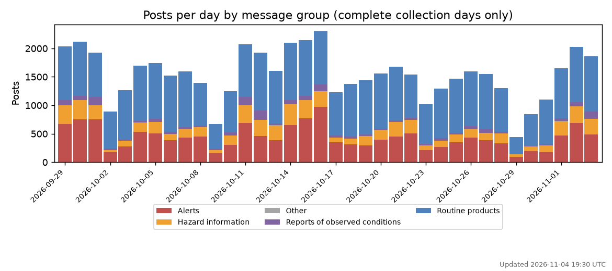
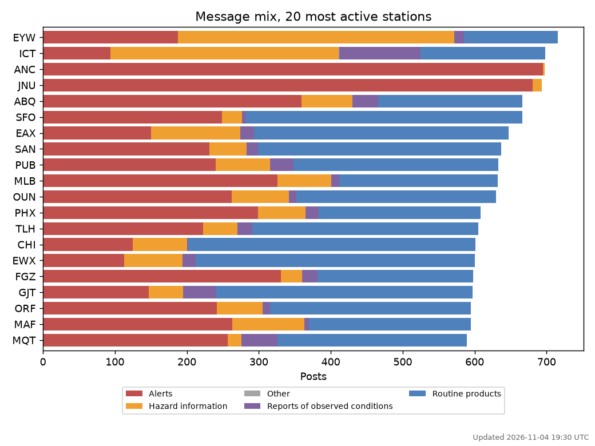

# CS401R
Scraping API on emergency data services for a class research project

- Output is stored in bluesky_posts.xlsx

<!-- SUMMARY:START (generated by code_posts.py, do not edit by hand) -->
## Coding summary

> **Last updated 2026-11-04 19:30 UTC** (refreshed automatically each time `bluesky_posts.xlsx` is pushed)

- **61,054** posts from **122** accounts
- Posts dated **2026-09-11** to **2026-11-04**
- Multi-part follow-up posts (2/3, 3/3...): 2,092

### Message types

| Message type | Posts | Share |
|---|---:|---:|
| Forecast discussion | 20,159 | 33.0% |
| Climate / records summary | 14,221 | 23.3% |
| Warning / watch / advisory | 13,029 | 21.3% |
| Outlook / situational awareness | 4,648 | 7.6% |
| Alert update or cancellation | 4,108 | 6.7% |
| Statement / short-term forecast | 2,803 | 4.6% |
| Storm report / public information | 2,058 | 3.4% |
| Other / uncoded | 28 | 0.0% |

### Posting over time

Only days fully covered by the daily collection are shown. The first run pulled each account's latest posts only, so earlier days are incomplete.

### Hazards in alerts

### Differences between stations

Full per-station tables are in the `station_by_type` and `station_by_group_pct` sheets of `bluesky_posts_coded.xlsx`.

---

Last updated 2026-11-04 19:30 UTC from 61,054 coded posts.
<!-- SUMMARY:END -->
